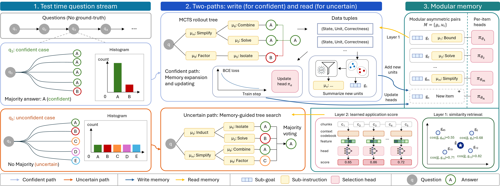

# MILES: Modular Instruction Memory with Learnable Selection for Self-Improving LLM Reasoning
[Ruilin Tong](https://github.com/RuilinTong), [Dong Gong](https://donggong1.github.io/)

[Artificer AI Lab](https://donggong1.github.io/group/), [University of New South Wales (UNSW Sydney)](https://www.unsw.edu.au/)

## TODO
- [x] Release the code of MILES. (Coming soon)

## Abstract

Large language models increasingly improve their reasoning at test time via additional computation, yet most procedures treat each problem in isolation. When problems arrive sequentially, accumulating reusable experience across them can further improve performance. Existing memory-based methods either store whole-solution templates that generalize poorly to novel problems or use heuristic step-level selection that is not optimized for final-answer correctness.

We propose <strong>MILES</strong> (<strong>M</strong>odular <strong>I</strong>nstruction Memory with <strong>LE</strong>arnable <strong>S</strong>election for self-improving LLM reasoning), a framework that dynamically expands step-wise memory and applies correctness-optimized memory composition under realistic test-time constraints. MILES maintains modular memory units consisting of asymmetric pairs of sub-goal embeddings and sub-instructions, each associated with a learnable selection head.This memory structure enables a coarse-to-fine retrieval mechanism: the coarse level enables memory expansion and collects supervision for training selection heads from confident samples, while the fine stage applies learned selection heads to rerank coarse-level candidates and guide reasoning for uncertain samples. 

Experiments across six reasoning benchmarks demonstrate the effectiveness, robustness, and transferability of MILES.

## Method Overview

